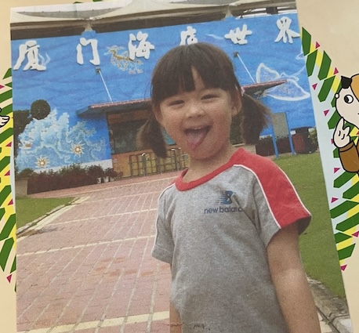
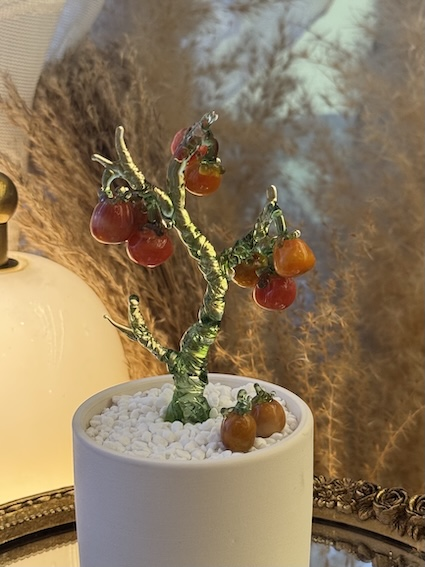

    
# **about me**

Welcome to my website! 

My name is Luyun Ge, currently a first year MS Biostatistics student at Mailman School of Public Health. 

Here is a picture of me:

# **Education so far**

Want to see the paper trail of my brain's journey? My resume is located [here](resume.html).

# **Fun Things**

My hobbies are... numerous. Perhaps worryingly so😅. Lately, I've been dabbling in glass art (mostly trying not to melt my fingers off 🔥), traveling and photography (subject matter: usually cats 🐈, sometimes landscapes).

Here's a glimpse: some glass that hasn't shattered (yet) 

and photos that aren't entirely blurry.

Dare to see more questionable creations? Click **[here](about_me.html)!**

